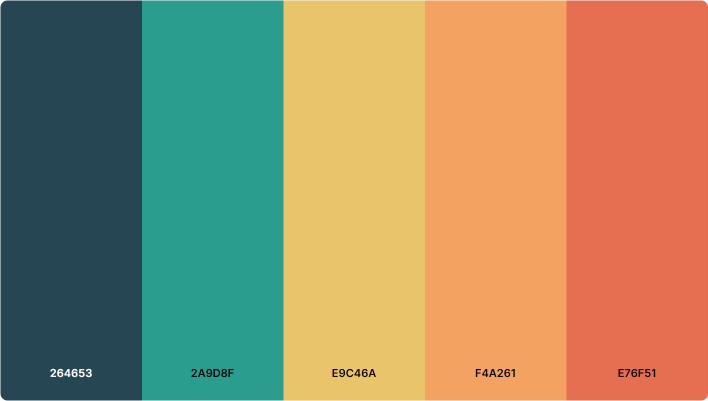
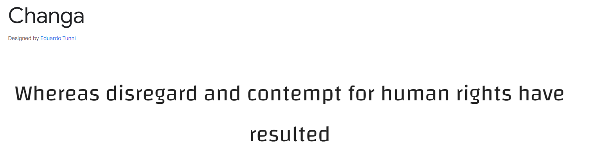

# *Quick Sushi*
---
## User Stories

### First Time Visitor Goals:
*	Basic restaurant information is very quick to find
*	Location of additional information links are clear and easy to find
*	Contact information is easy to find

### Returning Visitor Goals:
*	Able to find further information such as why choose us, other customer reviews, restaurant location information

### Frequent Visitor Goals:
*	Easy to find menu and price information
*	Contact information 
*	Open hours information

## Features

+ ### Navbar
    * Provides links to move between pages.
    * On mobile devices this is a collapsed drop-down selection to conserve screen space. 
    *

+ ### Home Page
    
    * Displays commonly searched information
    * Invites visitors to learn more about the restaurant
    * Shows new visitors what special options are available at this restaurant

+ #### Hero Section

    * Has a fixed image displaying the interior of the restaurant.
    * Image is overlayed with information about restaurant hours and location
    * Center of the hero image is a link to jump to the Reserve Table page 

+ #### Review Section
    * Displays a large collection of customer reviews to show new comers the positive experience others have had. 
    * When mouse hovering over a review image it grows and centers so the user is able to read the text clearly. 

---
+ #### About us Section
    * About us section displays unique options found at Quick Sushi. 
    * This area displays dining options for large groups and other creative options available.

---
+ #### Footer

    * Holds links for the restaurant social media.

---
+ ### Location Page

---
+ ### Menu page

---
## Technologies Used
---
## Design

### Color Scheme
 

 - A dark background with playful colours on top to encourage a fun and clean environment.
 - white text is used to improve readability where necessary. 

### Typography

- Changa Google Font was used as the main font to display an Asian / Japanese setting while still maintaining readability.

### Wireframes

### Local Deployment

## Future improvements
---
## Credits

+ #### Content
+ #### Media

+ #### Tools

---

## Acknowledgments
