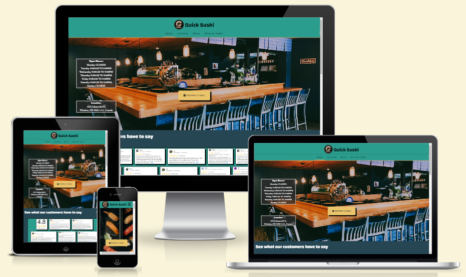

# *Quick Sushi*
---
## User Stories

### First Time Visitor Goals:
-	Basic restaurant information is very quick to find
-	Location of additional information links are clear and easy to find
-	Contact information is easy to find

### Returning Visitor Goals:
-	Able to find further information such as why choose us, other customer reviews, restaurant location information

### Frequent Visitor Goals:
-	Easy to find menu and price information
-	Contact information 
-	Open hours information

---
## Features

 ### Header
- Featured at the top of the page logo of the sushi business and the name is displayed large and centered on the page.
- The header uses the company theme text of 'Changa'.
- The header is also a quick link back to the main home page.

 

 

 ### Navbar
- Provides links to move between pages.
- On mobile devices, this is a collapsed drop-down selection to conserve screen space. 
- This heading area is displayed at the top of the page even when the user scrolls down so the page links are always available. 
- Navbar on the 'Menu' page hides as the user scrolls down to allow for more screen real-estate to view the menu images.

 ### Footer
- Displays clickable links for the restaurant social media.

 ### Home Page
- Displays commonly searched information
- Invites visitors to learn more about the restaurant
- Shows new visitors what special options are available at this restaurant

 #### Hero Section
- On large screen devices a fixed image displaying the interior of the restaurant is displayed.
- On smaller screen devices a fixed image displaying assorted sushi rolls is displayed.
- Image is overlayed with information about restaurant hours and location.
- Center of the hero image is a link to jump to the 'Reserve Table' page. 

 #### Review Section
- Displays a large collection of customer reviews to show newcomers the positive experience others have had. 
- When mouse hovering over a review image it grows and centers so the user is able to read the text clearly. 

    

 #### About Us Section
- displays unique options found at Quick Sushi in a card format with font and a visual style that matches the theme of the restaurant. 
- On a larger screen this is displayed as horizontal image and text, on smaller screens it adapts a vertical text image alignment to improve readability. 

    

 ### Location Page
- Location page displays a large Google map where the user can find the restaurant.
- A text box is also displayed to show the address in plain text

 ### Menu Page
- The menu page displays a long vertical list of all the menu page images.
- the user is able to jump to different menu topics using the menu nav bar locked at the top of the screen.
- unique on this page, the header becomes hidden as the user scrolls down to allow for more screen space to read the menu.

 ### Reserve Table Page
- This page displays a form for the user to fill out with the necessary information to book a table at the restaurant.
- Each field with an '-' is required.
- Each field checks the input data matches the format that was requested.
- Booth Table or Bar Seat radio buttons allow the user to choose where they want to sit, this is an optional choice.
- The 'Reserve now!' button submits the data to the restaurant.

 

### Reserve Table Response Page
 -  once the user has successfully entered in the form data, they will be sent to a confirmation page that has a link to return back to the home page.

     

---

## Technologies Used
- [HTML](https://developer.mozilla.org/en-US/docs/Web/HTML) was used as the foundation of the site.
- [CSS](https://developer.mozilla.org/en-US/docs/Web/css) - was used to add the styles and layout of the site.
- [Balsamiq](https://balsamiq.com/) was used to make wireframe design.
- [VSCode](https://code.visualstudio.com/) was used as the code editor.
- [GitHub](https://github.com/) was used to host the code of the website.
- [SourceTree](https://sourcetree.com) was used to manage the version control.
- [GIMP](https://www.gimp.org/) was used to edit and resize images.
- Google Dev Tools was used for website testing and debug.
- Google Light House was used for website testing.
- [Am I responsive](https://ui.dev/amiresponsive) was used to generate an image of the site on different screen sizes.
- [Markup Validation Service](https://validator.w3.org/) Was used to validate the HTML code.
- [CSS Validation Service](https://jigsaw.w3.org/css-validator/) Was used to validate the CSS code.

---
## Design

### Color Scheme
 - A dark background with playful colors on top encourages a fun and clean environment.
 - white text is used to improve readability where necessary. 

### Typography
- Changa Google Font was used as the main font to display an Asian / Japanese setting while still maintaining readability.

### Wireframes
See wireframe documentation:
[Wire Frames](assets/documentation/quicksushi_wireframe.pdf)

---
## Testing
 - testing the responsiveness of the website Google Chrome dev tools was used. 
 - An image of the different screen sizes was created with [Am I Responsive](https://ui.dev/amiresponsive).

### Manual Tests
 - All buttons and links were tested on multiple devices.
 - All clickable links have been checked for a hover action.
 - All forms have been tested only correct formatted inputs are accepted.
 - All forms have been tested that all required data is completed before the user can submit. 
 - Screen size responsiveness was tested on multiple devices and using Google Dev Tools.

### Light House Tests
- See below for Chrome Light House test results on each web page.

### Code Validation Tests 
- See below the results of the HTML and CSS validators.

### Bugs / known issues
- Menu nav bar was not able to use 'sticky' position type due to browser support, to overcome this a second nav bar is hidden behind the header and comes into view when the user scrolls down. If the user scrolls very slow, it is possible to have two menu nav bars overlapping. 
- The reserve table radio buttons are optional but once clicked it's not possible to make no selection, this could be fixed in the future with javascript. The other option would have been to add a third 'none' radio button but it was decided this would upset the aesthetic.

### Future improvements
 - Add a more interactive menu page.
 - Stager 'review' section review images, and animate to randomly display as the user scrolls past.
 - improve home page performance using different file types for images.
 - Animate the user reviews section scale transition to move more slowly for improved view experience.

---
## Credits

 ### Content
 - Code for the social media links and the mobile drop-down navigation menu was heavily influenced by the Code Institute [Love Running](https://github.com/Code-Institute-Org/love-running-2.0)

 ### Media
 - Media images sourced from the Quick Sushi Instagram page, used with permission.
 - Google reviews were sourced from Google Maps. 

### Acknowledgments
- [Iuliia Konovalova](https://github.com/IuliiaKonovalova) Who has been a knowledgeable and encouraging mentor on this project.
- [Web Dev Simplified](https://www.youtube.com/@WebDevSimplified) and [Kevin Powell](https://www.youtube.com/@KevinPowell) from YouTube for their quick and helpful CSS instruction videos.
- Rothanna and Teang Sim, owners of Quick Sushi for permission to use their restaurant as the subject of this project.
